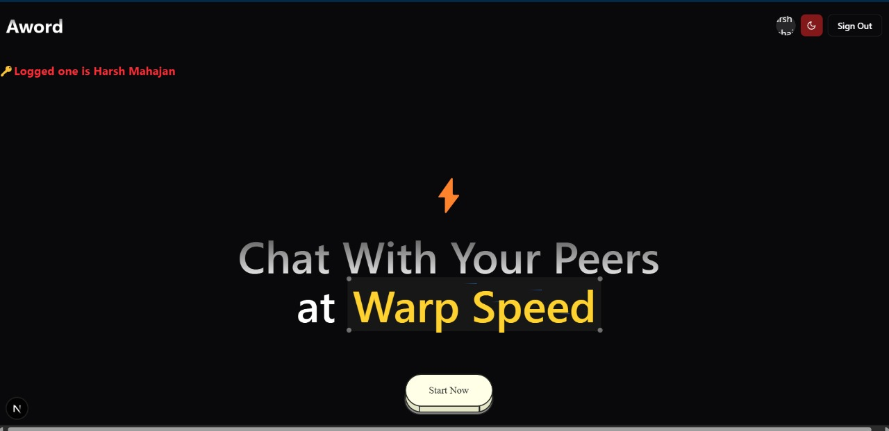
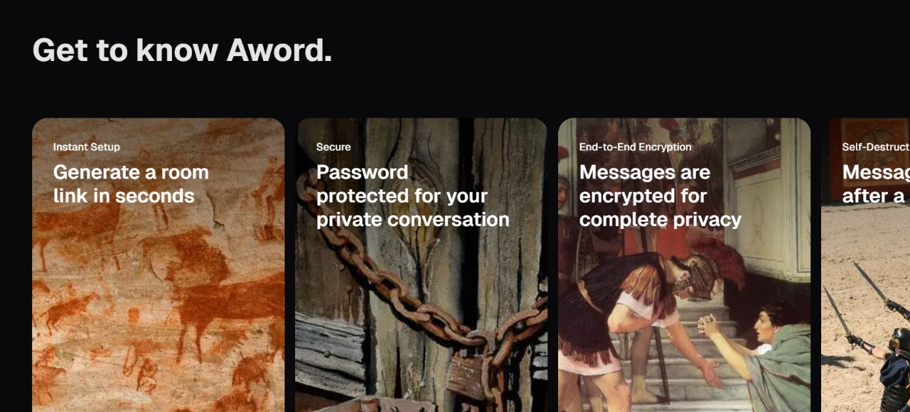
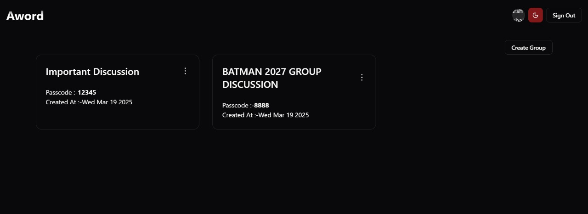
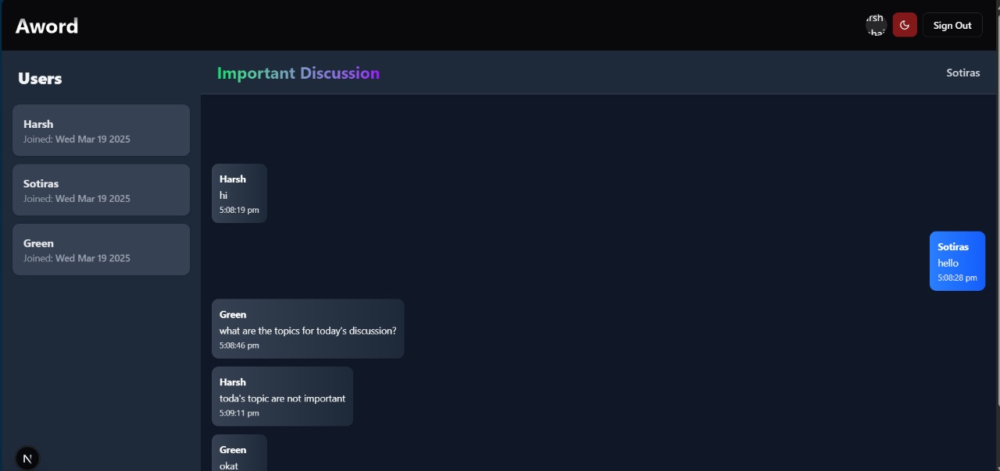
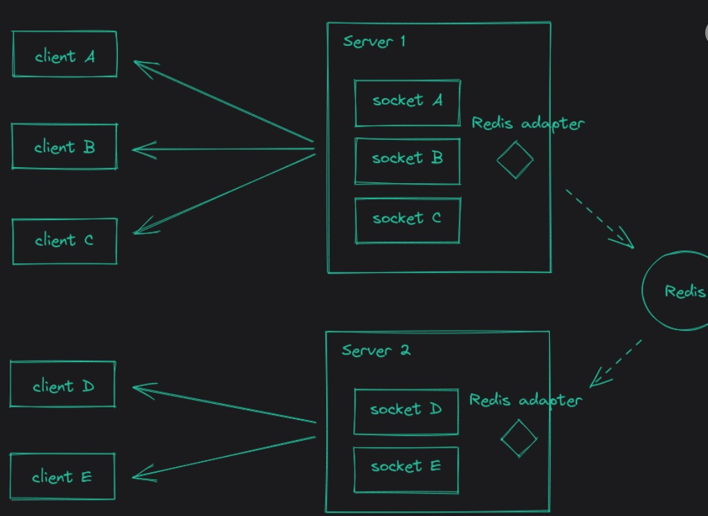

# Aword - Highly Scalable Messaging Service

**Aword** is a highly scalable, real-time messaging platform designed to handle thousands of concurrent users with ease. Built using **Next.js** for the frontend, **Express.js** for the backend, and powered by **Apache Kafka** for message queuing and **Redis Stream Adapter** for WebSocket connection management, Aword ensures high performance, reliability, and scalability. The platform allows users to create and join **anonymous group chat rooms** protected by numerical passwords, ensuring secure and private communication.

---

## Key Features

- **Real-Time Messaging**: Instant message delivery using WebSockets.
- **Anonymous Group Chat Rooms**: Create and join chat rooms with numerical passwords.
- **High Scalability**: Apache Kafka ensures the platform can handle thousands of concurrent users monitoring using kafkajs.
- **Efficient Connection Management**: Redis adapter for managing WebSocket connections.
- **User Authentication**: Secure authentication using JWT and OAuth (Google).
- **Responsive Design**: Built with Next.js for a smooth and responsive user experience.

---

## Technologies Used

- **Frontend**: Next.js (React)
- **Backend**: Express.js (Node.js)
- **Message Broker**: Apache Kafka
- **WebSocket Management**: Redis Adapter
- **Database**: PostgreSQL (hosted on Supabase)
- **Authentication**: JWT, Google OAuth

---

## Architecture Overview


The platform is divided into three main components:
1. **Frontend**: Built with Next.js, handles the user interface and interacts with the backend via REST APIs and WebSockets.
2. **Backend**: Built with Express.js, manages user authentication, message processing, and interacts with Kafka for message queuing.
3. **Message Broker**: Apache Kafka ensures messages are queued and delivered efficiently, even under high load.
4. **Redis Adapter**: Manages WebSocket connections and ensures real-time communication.

---

## Scalability

Aword is designed to support **thousands of concurrent users** with ease. By leveraging **Apache Kafka** for message queuing and **Redis** for WebSocket connection management, the system can scale horizontally to handle increasing loads.

---

## Installation

### Prerequisites

- Node.js (v16 or higher)
- npm or yarn
- Apache Kafka (running locally or on a server)
- Redis (running locally or on a server)( i am using upstash redis ...)
- PostgreSQL (hosted on Supabase or locally)

### Steps

1. **Clone the Repository**
   ```bash
   git clone https://github.com/HarshMN2345/Aword.git
   cd Aword
   ```

2. **Install Dependencies**
   ```bash
   # Install frontend dependencies
   cd frontend
   npm install

   # Install backend dependencies
   cd ../backend
   npm install
   ```

3. **Set Up Environment Variables**
   - Create a `.env` file in the `backend` directory:
     ```env
     DATABASE_URL="your_database_url"
     JWT_SECRET="your_jwt_secret"
     REDIS_URL="your_redis_url"
     KAFKA_BROKER="your_kafka_broker_url"
     KAFKA_TOPIC="your_kafka_topic"
     ```

   - Create a `.env.local` file in the `frontend` directory:
     ```env
     NEXTAUTH_URL="your_nextauth_url"
     NEXTAUTH_SECRET="your_nextauth_secret"
     NEXT_PUBLIC_APP_URL="your_app_url"
     NEXT_PUBLIC_BACKEND_URL="your_backend_url"
     GOOGLE_CLIENT_ID="your_google_client_id"
     GOOGLE_CLIENT_SECRET="your_google_client_secret"
     ```

4. **Run Kafka and Redis**
   - Start Kafka and Redis servers locally or use a cloud service.

5. **Start the Application**
   ```bash
   # Start the backend
   cd backend
   npm start

   # Start the frontend
   cd ../frontend
   npm run dev
   ```

6. **Access the Application**
   - Open your browser and navigate to `http://localhost:3000`.

---

## Demonstration

Watch the demo of Aword in action: [Demo Video](https://drive.google.com/file/d/11w83UjpZP0f9kKn9jQ54Z5GfRteb9eF0/view?usp=sharing)

---

## Screenshots







---

## License

This project is licensed under the MIT License. See the [LICENSE](LICENSE) file for details.

---

## Contact

For any questions or feedback, feel free to reach out:
- **Email**: harsh2345mahajan@gmail.com
- **GitHub**: [HarshMN2345](https://github.com/HarshMN2345)

---

Enjoy using Aword! 🚀